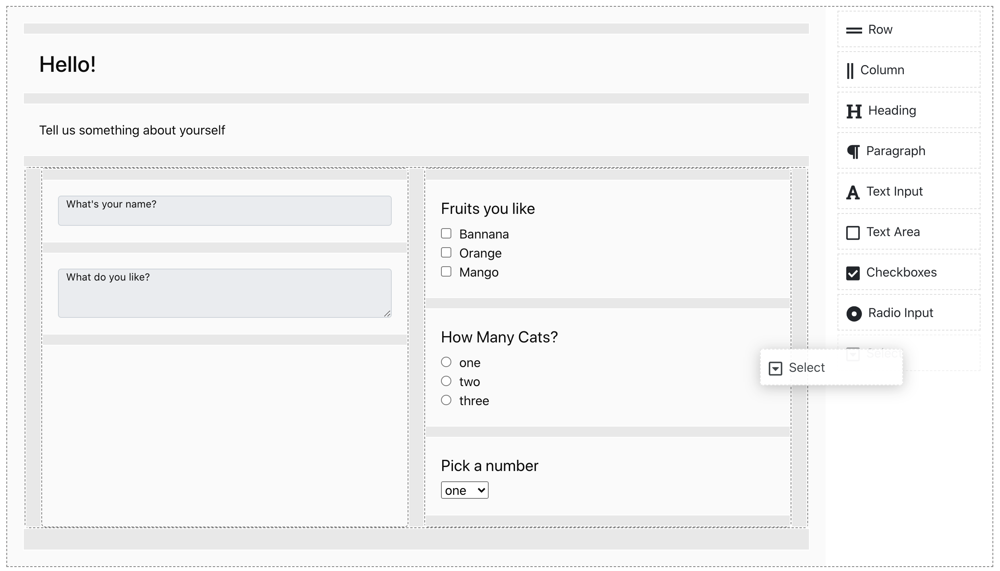

# formial

A simple drag and drop form builder and renderer

[](https://www.npmjs.com/package/formial)
[](https://github.com/nathanstitt/formial/actions)



## Install

```bash
npm install --save formial
```

## Usage

Example from [example/src/App.tsx](example/src/App.tsx)

```tsx
import React, { Component } from 'react'
import { Builder, Container, render } from 'formial'

const DEFAULT = {} // this would normally be loaded from server

const App = () => {
    const [value, setValue] = React.useState<Container>()
    const htmlRef = React.useRef(null)

    const onChange = (container: Container) => setValue(container)

    const renderHTML = () => {
        // json would normally be saved.
        // It's intended to be loading back into the editor or rendered to a form
        const json = value!.serialize()
        console.log(JSON.stringify(json))
        render(htmlRef.current!, json)
    }

    return (
        <div id="example-builder">
            <Builder onChange={onChange} defaultValue={DEFAULT} />
            <hr />
            <div><button onClick={renderHTML}>Render</button></div>
            <hr />
            <div ref={htmlRef}></div>
        </div>
    )
}

```

## License

MIT © [nathanstitt](https://github.com/nathanstitt/formial)
